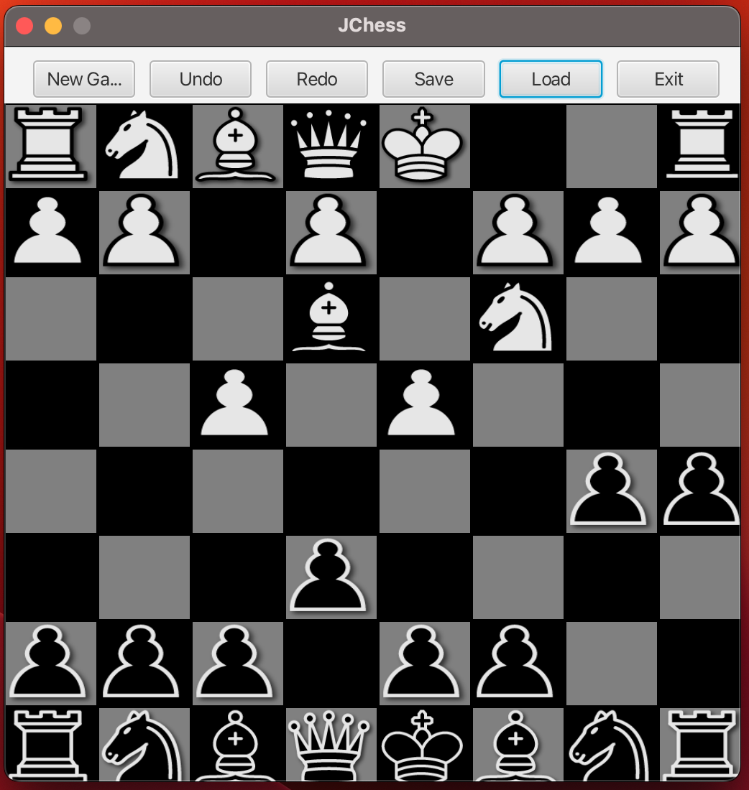

# JChess

[](https://github.com/javachaos/JChess/actions/workflows/codeql.yml)

## I made this in the last two days, there are flaws, it's a work in progress.

JChess is a Java application that lets you play chess with a graphical user interface (GUI) built using JavaFX. This chess game comes with several features such as the ability to save and load games to JSON files, and undo and redo moves.



## Features

JChess has the following features:

- Graphical user interface (GUI) built with JavaFX
- Save and load games to JSON files
- Undo and redo moves

## Getting started

To run the JChess application, you'll need to have Java and JavaFX installed on your system.

### Prerequisites

- Java (version 20 or higher)
- JavaFX (version 20 or higher)

### Installing

1. Clone the JChess repository to your local machine
2. Install Java and JavaFX if you don't have them already
3. Open a command prompt or terminal and navigate to the directory where you cloned the repository
4. Run the following command to compile and run the application:

```
./mvnw javafx:run
```
## Usage

To play JChess, simply start the application and begin playing! Use the mouse to click and drag pieces to move them on the board. To save a game, go to the "File" menu and select "Save". To load a saved game, go to the "File" menu and select "Load". To undo or redo a move, use the "Undo" and "Redo" buttons on the toolbar.

## Contributing

If you'd like to contribute to JChess, feel free to submit a pull request or open an issue on the GitHub repository.

## License

This project is licensed under the GPLv3 License - see the [LICENSE](LICENSE) file for details.

